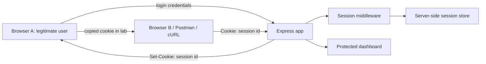

# Architecture Research: Session Hijacking Lab

## Recommended Architecture

## Components

- `server.js`: Express setup, session configuration, routes, mode switch.
- `views/` or static HTML templates: login, dashboard, attack guide, mitigation status.
- `public/`: minimal CSS and optional client script for vulnerable cookie visibility.
- `docs/demo-script.md`: step-by-step demonstration script.
- `docs/slides-outline.md`: slide content before exporting to PDF.
- `tests/`: optional smoke tests for vulnerable and fixed behavior.

## Modes

### Vulnerable Mode

Purpose: make the weakness visible and reproducible.

- Runs over HTTP.
- Uses weak cookie settings.
- Uses long-lived session.
- Makes cookie capture simple through DevTools or a local demo endpoint.
- Allows copied cookie to access the protected dashboard from another client.

### Fixed Mode

Purpose: show the same attack path failing after mitigation.

- Prefer HTTPS on localhost for `Secure` cookies.
- Uses `HttpOnly`, `Secure`, `SameSite=Lax` or `SameSite=Strict`, and short `maxAge`.
- Destroys session on logout.
- Regenerates session after login if feasible.
- Rejects copied, expired, or destroyed sessions.

## Demo Flow

1. Start vulnerable mode.
2. Log in as a fictitious user.
3. Copy the session cookie.
4. Inject or send the cookie from another client.
5. Show unauthorized access to the dashboard.
6. Restart or switch to fixed mode.
7. Repeat the same copy/reuse attempt.
8. Show rejection, logout invalidation, or expiration behavior.

## Security Boundary

All attack steps must be limited to localhost and fictitious data. The architecture should not include any functionality that encourages testing against external systems.
